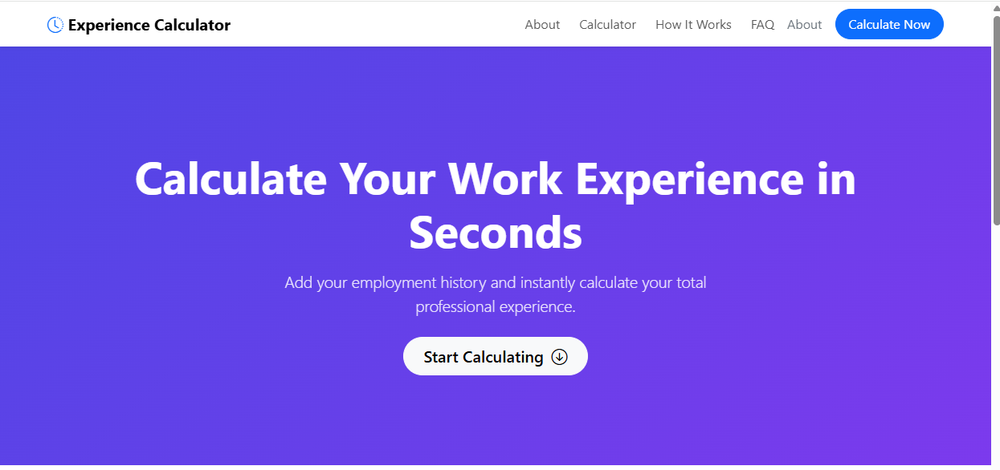

# 💼 Experience Calculator

A modern and user-friendly **Work Experience Calculator** that allows users to enter their complete employment history and instantly calculate their total professional experience.

The application is designed to make experience calculation simple, fast, accurate, and easy to understand.

---

## 🚀 Overview

**Experience Calculator** helps users calculate their total professional work experience by entering individual employment periods.

Users can:

- Add multiple jobs or employment periods
- Select joining and leaving month/year
- Mark their current employment
- Add multiple organizations/jobs
- Automatically calculate total professional experience
- View their experience in an easy-to-understand format

This tool can be useful for:

- 👨‍💻 Software Developers
- 👩‍💼 Job Seekers
- 📄 Resume Preparation
- 🎯 Job Applications
- 🏢 HR & Recruitment Teams
- 🎓 Career Planning
- 💼 Professional Profile Management

---

## ✨ Key Features

### 📅 Multiple Employment Periods

Users can add multiple jobs and employment periods to calculate their combined professional experience.

### 🔄 Current Employment Support

The application provides a **"I currently work here"** option for users who are still working at their current organization.

### ⚡ Instant Experience Calculation

Once employment details are entered, the application calculates the user's total professional experience automatically.

### 🎯 Simple User Interface

The interface is designed with a clean, modern, and distraction-free layout so users can calculate their experience without confusion.

### 📱 Responsive Design

The application is designed to provide a consistent experience across different screen sizes and devices.

### 🧮 Accurate Date-Based Calculation

The calculator processes the selected employment periods and determines the overall professional experience based on the entered dates.

---

# 🖥️ Application Screenshots

## 1. Home Page

The landing page introduces the Experience Calculator and provides a clear call-to-action to start calculating professional experience.



---

## 2. Employment Details

Users can enter each employment period by selecting:

- Start Month
- Start Year
- End Month
- End Year
- Current employment status

Users can also add multiple jobs using the **"Add Another Job"** option.


---

# 🔄 How It Works

The application follows a simple three-step process:

### Step 1 — Start Calculating

Click the **"Start Calculating"** button from the home page.

### Step 2 — Enter Employment History

For every job, enter:

```text
Start Month → Start Year
End Month   → End Year
